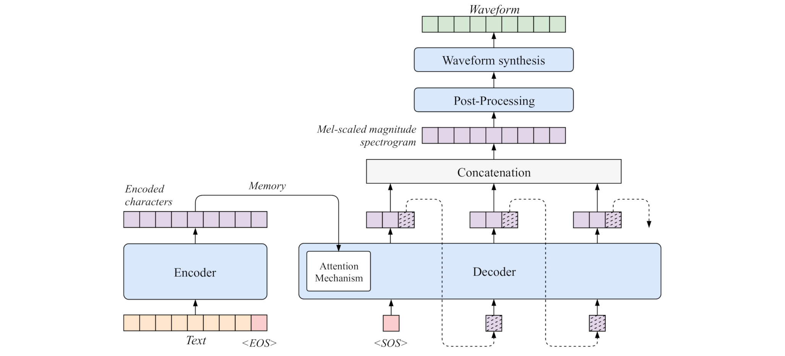
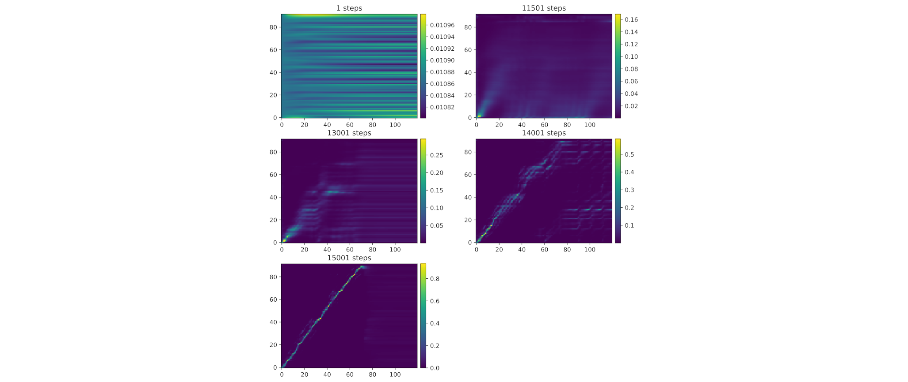
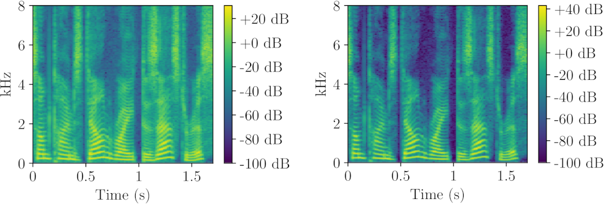

# Single-Speaker End-to-End Neural Text-to-Speech Synthesis

<!-- [](https://circleci.com/gh/) -->
[](https://github.com/yweweler/speech-synthesis/master/LICENSE.txt)

This is a single-speaker neural text-to-speech (TTS) system capable of training in a end-to-end fashion.
It is inspired by the [Tacotron](https://arxiv.org/abs/1703.10135v2) archicture and able to train based on unaligned text-audio pairs.
The implementation is based on [Tensorflow](https://tensorflow.org/).


## Examples

* Blizzard Challenge 2011 (Nancy Corpus)
  - 
  - 
  - 
  - 
  - 
  - 
  - 
  - 

## Architecture


The architecture is inspired by the [Tacotron](https://arxiv.org/abs/1703.10135v2) archicture and takes unaligned text-audio pairs as input to learn from.
Based on entered text it produces linear-scale frequency spectrograms and an alignment between text and audio.

The architecture is constructed from four main stages:

1. Encoder
2. Decoder
3. Post-Processing
4. Waveform synthesis

The encoder takes written sentences and generates variable length embeddings for each sentence.
The subsequent decoder decodes the variable length embedding into a Mel-spectrogram.
With each decoding iteration the deocder predicts `r` spectrogram frames at once.
The frames predicted with each iteration are concatenated to form the complete Mel-spectrogram.
To predict the spectrogram the decoder's attention mechanism selects the character embeddings (memory) it deems most important for decoding.
In turn giving the attention alignments.
The post-processing stage upgrades the Mel-spectrogram into a linear-scale spectrogram.
It's job is to improve the spectrograms and pull up the Mel-spectrogram to linear-scale.
Finally, the Griffin-Lim algorithm is used for the synthesis stage to retrieve the final waveform.



### Attention
Instead ofthe [Bahdanau](https://arxiv.org/abs/1409.0473v7) style attention mechanism Tacotron uses, the architecture employs [Luong](https://arxiv.org/abs/1508.04025v5) style attention.
We implemented the global as well as local attention approaches as described by Luong.
Note however, that the local attention approach is somewhat basic and experimental.


#### Alignments

The attention mechanism predicts an probability distribution over the the encoder hidden states 
with each decoder step.
Concatenating these leads to the actual alignments for the encoder and the decoder sequence.

As an example take a look at the progress of the alignment predicted at different amounts of 
training.


### CBHG

The CBHG (1-D convolution bank + highway network + bidirectional GRU) module is adopted from the Tacotron architecture.
It is used both in the encoder and the decoder.
Take a look at the implementation for more details on how it works ([tacotron/layers.py]
(tacotron/layers.py#L448))


### Encoder


### Decoder


### Post-Processing


## Prerequisites

On machines where Python 3 is not the default Python runtime, you should use ``pip3`` instead of ``pip``.

```bash
sudo apt-get install python3 python3-pip
```


## Installation

```bash
git clone https://github.com/yweweler/speech-synthesis.git
cd speech-synthesis
sudo pip install -r requirements.txt
```


## Dataset Preparation

Datasets are loaded using datset loaders.
Currently each dataset requires a custom dataset loader to be written.
Depending on how the loader does its job. the datasets can be stored in nearly any form and file-format.
If you want to use a custom dataset, you curretnly have to write a custom loading helper.
A few custom loaders for datasets exist already.

```bash
datasets
├── blizzard_nancy.py
├── cmu_slt.py
├── lj_speech.py
...
```

Note that this loading procedure will change in the future, so that no custom loader code will be required anymore.

---

Lets see how preparation is performed using the Blizzard Nancy ([Blizzard Challenge 2011](https://www.synsig.org/index.php/Blizzard_Challenge_2011)) dataset as an example.
The prepared dataset the loader would be able to load looks like this.
```bash
blizzard-nancy
├── listing.txt -> train.txt
├── train.txt
├── eval.txt
└── wav
    ├── APDC2-023-10.wav
    ├── APDC2-024-04.wav
    └── ...
```
The `train.txt` and the `eval.txt` files contain filenames and corresponding transcriptions.
The `listing.txt` file is a symlink pointing to `train.txt` or `eval.txt` depending on wether we want to train or to evaluate.
Audio files are contained in the `wav` folder

The blizzard nancy loader loads transcriptions from a `txt` file were each line is of the form:

```bash
<wav-filename-without-extension> <transcription>\r\n
```

For each transcription the loader loads a 16 Bit WAVE audio file from the `wav` folder based on the filename.
```bash
file wav/APDC2-023-10.wav

# wav/APDC2-023-10.wav: RIFF (little-endian) data, WAVE audio, Microsoft PCM, 16 bit, mono 16000 Hz
```
It expects all file to have a 16 kHz sampling rate.

The `listing.txt` symlink has to be created manually depending on wether you are currently doing training or evaluation with the model.
instead of using symlinks you can alternatively just copy and rename the transcription file as needed.
The code is not optimal when it comes to dataset loading (pull requests are welcome though).

### Signal statistics

The spectrograms used are scaled linearly to fit the range `(0.0, 1.0)` using global minimum and maximum dB values calculated on the training corpus.
Currently these statistics have to be extracted before training or evaluation and the values have to be inserted into the dataset lader manually.

To calculate the statistics run:

```bash
python tacotron/dataset_statistics.py
```

Take the following example output:
```bash
# Dataset: /exmaple-dataset
# Loading dataset ...
# Collecting decibel statistics for 243 files ...
# mel_mag_ref_db = 9.554028542124794
# mel_mag_max_db = -99.8760138753366
# linear_ref_db = 36.5140945917124
# linear_mag_max_db = -99.9965083885114
```

Each loader derived from `DatasetHelper` has to define these variables in order to be able to 
normalize the audio files.

### Feature Pre-Calculation

Instead of calculating features on demand during training or evaluation, the code also allows to pre-calculate and store them on disk.

To pre-calculate features run:

```bash
python tacotron/dataset_precalc_features.py
```

The pre-computed features are stored as `.npz` files next to the actual audio files.
Note that independent from pre-calculation, features can also be cached in RAM to accelerate throughput.


## Training

Configure the desired parameters for the model:

1. Setup the architecture parameters in [tacotron/params/model.py](https://github.com/yweweler/speech-synthesis/master/tacotron/params/model.py)
2. Prepare the training dataset:
  1. Calculate dataset signal statistics.
  2. Setup the dataset parameters in [tacotron/params/dataset.py](https://github.com/yweweler/speech-synthesis/master/tacotron/params/model.py)
  3. **Optional**: Pre-calculate the features for the dataset.
3. Setup the training parameters in [tacotron/params/training.py](https://github.com/yweweler/speech-synthesis/master/tacotron/params/training.py)

Start the training process:
```bash
python tacotron/training.py
```

You can stop the training process any time by killing the training process using ``CTRL+C`` on the terminal for example.

Note that you can *resume training* at the last saved checkpoint by just starting the training process again.
The training code will then look for the most recent checkpoint in the checkpoint folder configured.


## Evaluation

Configure the desired evaluation parameters:

1. Setup the evaluation parameters in [tacotron/params/evaluation.py](https://github.com/yweweler/speech-synthesis/master/tacotron/params/evaluation.py)
2. Prepare the evaluation dataset:
  1. Calculate dataset signal statistics.
  2. Setup the dataset parameters in [tacotron/params/dataset.py](https://github.com/yweweler/speech-synthesis/master/tacotron/params/model.py)
  3. **Optional**: Pre-calculate the features for the dataset.

Start the evaluation process:
```bash
python tacotron/evaluate.py
```

If configured, the evaluation code will sequentially load all training checkpoints from a folder and evaluate each of them.


## Inference

Configure the desired inference parameters:

1. Setup the inference parameters in [tacotron/params/inference.py](https://github.com/yweweler/speech-synthesis/master/tacotron/params/inference.py)
2. Place a file with all the sentences to synthezise at the location configured. This is supposed to be a simple text file with one sentence per line.

Start the inference process:
```bash
python tacotron/inference.py
```

Your synthezised files (and debug outputs) are dropped into the configured folder.

### Spectrogram Power

The magnitudes of the produced linear spectrogram are rised to a power (default is `1.3`) to reduce perceived noise.



This parameter is not learned by a model. It has to be determined for each dataset manually.
There is no direct rule on what value is best.
However, note that higher values tend to surpress the higher frequencies of the produced voice. This leads to a voice is muffled.
Usually a value greater `1.0` and bellow `1.6` works best (depending on the amount of noise perceived).


## Pre-Trained Models

Currently I do not plan to deliver pre-trained models as their distribution might interfer with the licenses of the datasets used.
If you are interested in pre-trained models please feel free to message me.

If you are willing to provide pre-trained checkpoints for the model on your own, feel free to open a pull-request.


## Contributing

All contributions are warmly welcomed. Below are a few hints to the entry points of the code and a link to the to do list.
Just open a pull request with your proposed changes.

### Entry Points
* The model architecture is implemented in [tacotron/model.py](https://github.com/yweweler/speech-synthesis/master/tacotron/model.py).
* The model architecture parameters are defined in [tacotron/params/model.py](https://github.com/yweweler/speech-synthesis/master/tacotron/params/model.py).
* The train code is defined [tacotron/train.py](https://github.com/yweweler/speech-synthesis/master/tacotron/train.py).
* Take a look at [datasets/blizzard_nancy.py](https://github.com/yweweler/speech-synthesis/master/datasets/blizzard_nancy.py) to see how a dataset loading helper has to implemented.

### Todo
See [Issues](https://github.com/yweweler/speech-synthesis/issues)


## License

```
Copyright 2018 Yves-Noel Weweler

Permission is hereby granted, free of charge, to any person obtaining a copy of this software and associated documentation files (the "Software"), to deal in the Software without restriction, including without limitation the rights to use, copy, modify, merge, publish, distribute, sublicense, and/or sell copies of the Software, and to permit persons to whom the Software is furnished to do so, subject to the following conditions:

The above copyright notice and this permission notice shall be included in all copies or substantial portions of the Software.

THE SOFTWARE IS PROVIDED "AS IS", WITHOUT WARRANTY OF ANY KIND, EXPRESS OR IMPLIED, INCLUDING BUT NOT LIMITED TO THE WARRANTIES OF MERCHANTABILITY, FITNESS FOR A PARTICULAR PURPOSE AND NONINFRINGEMENT. IN NO EVENT SHALL THE AUTHORS OR COPYRIGHT HOLDERS BE LIABLE FOR ANY CLAIM, DAMAGES OR OTHER LIABILITY, WHETHER IN AN ACTION OF CONTRACT, TORT OR OTHERWISE, ARISING FROM, OUT OF OR IN CONNECTION WITH THE SOFTWARE OR THE USE OR OTHER DEALINGS IN THE SOFTWARE.
```

See [LICENSE.txt](https://github.com/yweweler/speech-synthesis/master/LICENSE.txt)
